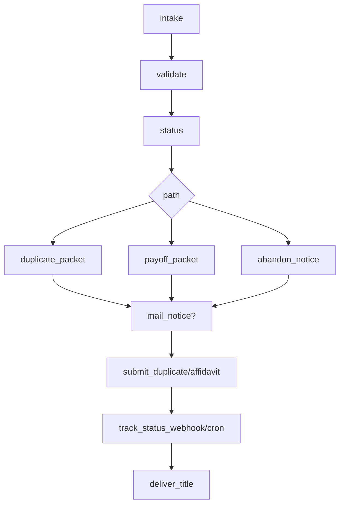
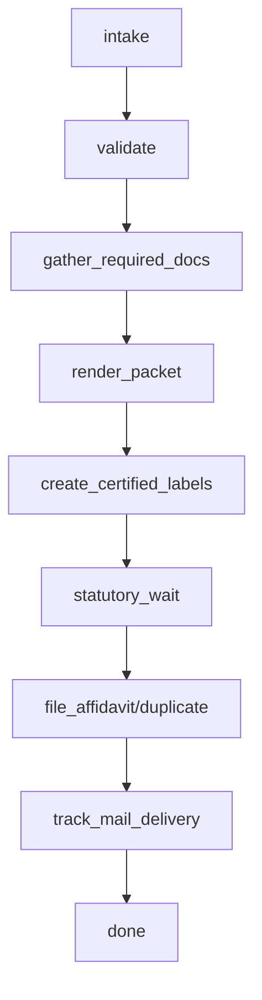

# Task Dependency Graphs (Reference)

## Duplicate Title (API State) DAG

## Manual State DAG

## Dependency Rules
- Partition key: `tenant_id:home_id`; tasks for a home run sequentially.
- Parallelism allowed inside independent steps (e.g., generating multiple notices) but results must merge into a single `task_event`.
- Each step outputs `{status, data, events[]}`; reducers update projections.
- Any step may emit `needs_human` to pause DAG; UI shows required actions.

## DAG Validation
- CLI lints DAGs to ensure: no orphan steps, branch coverage complete, terminal node present, max depth under configurable limit, and no forbidden cycles.
